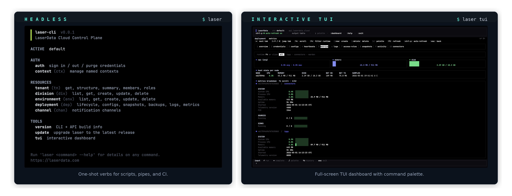

# Laser CLI

Public release artefacts for `laser`, the command-line and TUI for [LaserData](https://laserdata.com) Cloud. Linux + macOS, single static binary, no runtime dependencies.



## Install

```sh
curl -fsSL https://cli.laserdata.cloud/install.sh | sh
```

The installer detects OS + arch, downloads the matching archive from the latest release, verifies the SHA-256 checksum, and drops `laser` into `$HOME/.local/bin` (or `$LD_PREFIX` if set). Re-run any time to upgrade.

### Flags (`sh -s --`)

| Flag | Effect |
| --- | --- |
| `--to <dir>` | Install dir (default `$HOME/.local/bin`) |
| `--version <vX.Y.Z>` | Pin release tag (default latest) |
| `--with-cc-skills` | Also install/update the Claude Code skill pack from `cli.laserdata.cloud/claude.sh` |
| `--help` | Show help |

### Env vars

| Var | Effect |
| --- | --- |
| `LD_VERSION` | Pin tag |
| `LD_PREFIX` | Override install dir |

### Recipes

```sh
# Pin a version.
curl -fsSL https://cli.laserdata.cloud/install.sh | sh -s -- --version v0.0.1

# Bundle Claude Code skills in the same step.
curl -fsSL https://cli.laserdata.cloud/install.sh | sh -s -- --with-cc-skills

# Pinned version + custom dir + skills.
curl -fsSL https://cli.laserdata.cloud/install.sh \
  | sh -s -- --version v0.2.1 --to /usr/local/bin --with-cc-skills
```

Idempotent: re-running upgrades binary (overwrite) and skills (`cp -f`) in place. Safe to script in CI / dotfiles.

In-place upgrades from an existing install:

```sh
laser update
```

## Two modes, one binary

### Headless (default)

Every verb runs as a one-shot, exits zero on success, non-zero on failure. Composes with `&&`, `||`, `xargs`, GNU parallel, cron, CI runners.

```sh
laser auth login                              # interactive on a TTY, env var on CI
laser tenant get -o json
laser deployment list --silent && echo ok     # quiet success path
```

`--silent` suppresses success output without affecting stderr or exit codes. `-o json | yaml | name` for machine-readable output. `--debug` for stderr trace.

### TUI

```sh
laser tui
```

Full-screen TUI dashboard with mouse + keyboard, command palette, persistent history. Drives the same backend as the headless verbs. Pass `--interactive` to any verb to run it inside the TUI with rendered output.

## Claude Code skills

If you drive `laser` from inside [Claude Code](https://docs.anthropic.com/claude/docs/claude-code), install the official skill pack.

One-shot with the binary:

```sh
curl -fsSL https://cli.laserdata.cloud/install.sh | sh -s -- --with-cc-skills
```

Or via the Claude Code marketplace:

```
/plugin marketplace add laserdata/laser-cli-claude
/plugin install cli@laser
```

Or skills only:

```sh
curl -fsSL https://cli.laserdata.cloud/claude.sh | sh
```

Adds slash commands like `/laser-deploy`, `/laser-troubleshoot`, `/laser-snapshot`, `/laser-credentials`. Source: <https://github.com/laserdata/laser-cli-claude>.

## Authentication

```sh
laser auth login --tenant-id <numeric-id>
```

The API key (generated at <https://laserdata.cloud>) lands in the OS keyring (Keychain on macOS, Secret Service on Linux). The CLI validates the key against `/tenants/<id>/api_keys/context` on login; on success the resolved role is printed back. The tenant id is required on first login: pass `--tenant-id`, set `LD_TENANT_ID`, or run from a context that already has one saved.

For headless / agent / CI use:

```sh
export LD_API_KEY=...
export LD_TENANT_ID=...
```

## Local state

XDG-aware, platform-correct paths:

- `$XDG_CONFIG_HOME/laser/contexts.toml` - named contexts (mode 0600, atomic writes; api keys live in the OS keyring, not on disk).
- `$XDG_DATA_HOME/laser/history` - TUI command history (capped, secrets redacted before write).
- `$XDG_DATA_HOME/laser/logs/laser-YYYY-MM-DD.log` - rolling daily debug log; `LD_LOG_FILE=trace` for verbose.

## Releases

Each release on this repo ships:

- `laser-<ver>-x86_64-unknown-linux-gnu.tar.xz` + `.sha256`
- `laser-<ver>-aarch64-unknown-linux-gnu.tar.xz` + `.sha256`
- `laser-<ver>-aarch64-apple-darwin.tar.xz` + `.sha256`
- `install.sh` + `install.sh.sha256`

Report a bug or request a feature: <https://github.com/laserdata/laser-cli-releases/issues>.

## Documentation

<https://docs.laserdata.cloud>

## License

Source code is private; the binary distributed here may be used per the LaserData terms of service.
